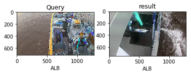
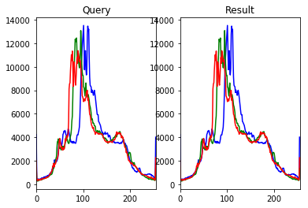
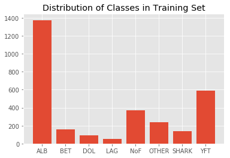
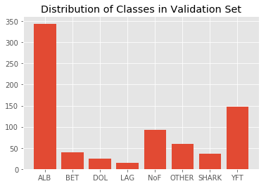
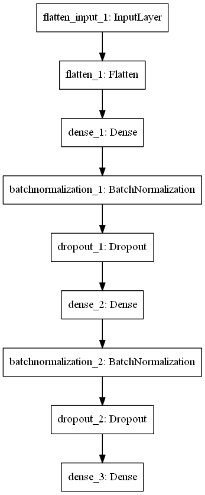
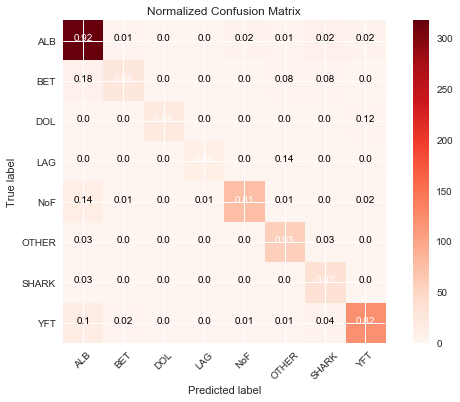
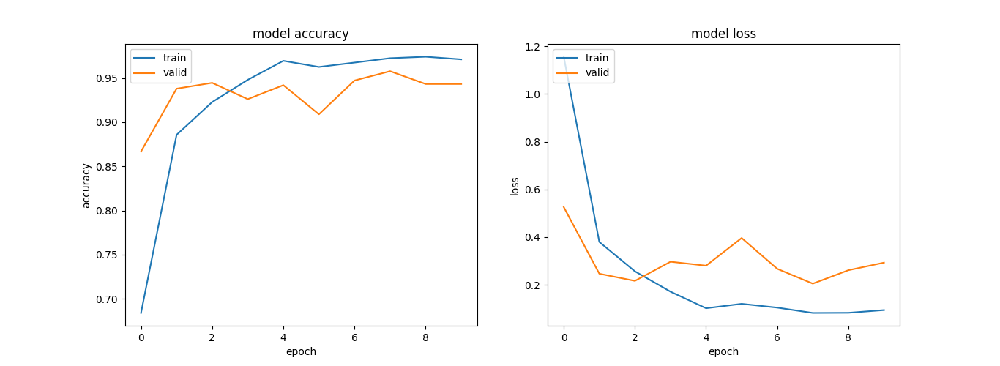

# Machine Learning Engineer Nanodegree

## Capstone Project

Tahsin Mayeesha

Date : 1/3/2017

# I. Definition

### 1.1. Project Overview

Almost 50% of the world depends on seafood for their main source of protein. And most of the worlds high grade fish supply comes from Western and Pacific Region, which accounts for around $7 billion market. However, illegal fishing remains a threat for the marine ecosystem in these regions as fishermen often engage in overfishing and catching of protected species for deep-sea tourism such as shark and turtles. According to [Fortune report on current usage of  artificial intelligence in fishing industry](http://fortune.com/2016/11/14/deep-learning-artificial-intelligence-tuna-industry/?iid=leftrail) , big fishing companies such as Luen Thai fishing reports that fishing operators in the pacific region typically sends a physical observer to accompany fishermen about 10 times out of 200 times in a year, however, this is clearly insufficient as there's no one to monitor what is going on in the other 190 trips per boat.

To combat the problem of proper monitoring, [The Nature Conservancy](http://www.nature.org/) , a global nonprofit fighting environmental problems has decided to create a technological solution by installing electronic monitoring devices such as camera, sensors and GPS devices to record all activities on board to check if they are doing anything illegal. 

However, even if having access to hours of raw footage is useful, according to TNC, for a 10 hour long trip, reviewing the footage manually takes around 6 hours for reviewers. On top of hectic conditions on a fishing boat, poor weather conditions such as insufficient light, raindrops hitting the camera lenses and people obstructing the view of fishes, often by choice, makes this task even harder for a human reviewer. 

To automate this process, TNC partnered with [Kaggle](www.kaggle.com) to ask machine learning practitioners to build a system that automatically detects and classifies fishes from the video footage data with a $150,000 prize to offset the costs involved in training deep convolutional neural network. [The Nature Conservancy Fishery Monitoring](https://www.kaggle.com/c/the-nature-conservancy-fisheries-monitoring) competition has attracted the attention of the contestants and have been featured in publications such as [Engadget](https://www.engadget.com/2016/11/18/how-humans-and-machines-can-save-the-tuna/) ,[Guardian](https://www.theguardian.com/sustainable-business/2016/nov/20/artificial-intelligence-illegal-fishing-tuna-sharks) and [Fortune](http://fortune.com/2016/11/14/deep-learning-artificial-intelligence-tuna-industry/?iid=leftrail). The aim of this capstone project is to build a convolutional neural network that classifies different species of fishes while working reasonably well under constraints of computation. My personal interest for this project comes from the fact that I'm passionate about animal preservation and I've also competed in another Kaggle competition where the task was to predict outcomes of shelter animals. Given this competition is practical and underrated, as the dataset is compiled by a non-profit instead of a for-profit company for recruitment, that is also a motivating aspect for me.

### 1.2. Problem Statement

The fish dataset was labeled by TNC by identifying objects in the image such as tuna, opah, shark, turtle, boats without any fishes on deck and boats with other fishes and small baits. 

The goal is to predict the likelihood that a fish is from a certain class from the provided classes, thus making it a multi-class classification problem in machine learning terms. 

Eight target classes are provided in this dataset : Albacore tuna, Bigeye tuna, Yellowfin tuna, Mahi Mahi, Opah, Sharks, Other (meaning that there are fish present but not in the above categories), and No Fish (meaning that no fish is in the picture). 

The goal is to train a CNN that would be able to classify fishes into these eight classes. 

Deep learning based techniques (CNNs)has been very popular in the last few years where they consistently outperformed traditional approaches for feature extraction to the point of winning imagenet challenges. In this project, transfer learning along with data augmentation will be used to train a convolutional neural network to classify images of fish to their respective classes. 

Transfer learning refers to the process of using the weights from pre-trained networks on large dataset. As the pre-trained networks have already learnt how to identify lower level features such as edges, lines, curves etc with the convolutional layers which is often the most computationally time consuming parts of the process, using those weights help the network to converge to a good score faster than training from scratch. Participants of similar image classification challenges in Kaggle such as [Diabetic Retinopathy](https://www.kaggle.com/c/diabetic-retinopathy-detection) , [Right Whale detection](https://deepsense.io/deep-learning-right-whale-recognition-kaggle/) (which is also a marine dataset)  has also used transfer learning successfully.

To train a CNN model from scratch successfully, the dataset needs to be huge(which is definitely not the case here, the provided dataset from Kaggle is very small, only 3777 images for training) and machines with higher computational power is needed, preferably with GPU, which I don't have access to at this point. Fortunately many such networks such as RESNET, Inception-V3, VGG-16 pretrained on [imagenet challenge](http://www.image-net.org/challenges/LSVRC/) is available for use publicly and I'll be using one of them VGG-16, created by  [Oxford's Visual Geometry Group](http://www.robots.ox.ac.uk/~vgg/research/very_deep/)  for this competition. There's another version of VGG, namely VGG-19 with very similar level of accuracy, however using it is more computationally expensive so I'd not be using it.

### 1.3. Metrics

The metric used for this Kaggle competition is **multi-class logarithmic loss** (also known as categorical cross entropy)

$$
log loss = \frac{1}{N}\sum_{i}^{N}\sum_{j}^{M}y_{ij}\log(p_{ij})
$$
Here each image has been labeled with one true class and for each image a set of predicted probabilities should be submitted. $N$ is the number of images in the test set, $M$ is the number of image class labels, $log$ is the natural logarithm, $y_{ij}$ is 1 if observation $i$ belongs to class $j$ and 0 otherwise, and $p_{ij}$ is the predicted probability that observation $i$ belongs to class $j$. 

The submitted probabilities for a given image are not required to sum to one because they are rescaled prior to being scored (each row is divided by the row sum). A perfect classifier will have the log-loss of 0.

Multiclass log-loss punishes the classifiers which are confident about an incorrect prediction. In the above equation, if the class label is 1(the instance is from that class) and the predicted probability is near to 1(classifier predictions are correct), then the loss is really low as ${log(x)\to0 }$ as ${x\to1}$ , so this instance contributes a small amount of loss to the total loss  and if this occurs for every single instance(the classifiers is accurate) then the total loss will also approach 0. 

On the other hand, if the class label is 1(the instance is from that class) and the predicted probability is close to 0(the classifier is confident in its mistake), as $log(0)$ is undefined it approaches $-\infty$ so theoretically the loss can approach infinity. In order to avoid the extremes of the log function, predicted probabilities are replaced with $max(min(p,1−10^{15}),10^{15})$ .

Graphically[^1] , assuming the $i_{th}$ instance belongs to class $j$  and $y_{ij}$ = 1 , it's shown that when the predicted probability approaches 0, loss can be very large.

# **II. Analysis**

### 2.1.  Data overview

To create the dataset, TNC compiled hours of boating footage and then sliced the video into around 5000 images which contains fish photos captured from various angles.The dataset was labeled by identifying objects in the image such as tuna, shark, turtle, boats without any fishes on deck and boats with other small bait fishes. 

The dataset features 8 different classes of fish collected from the raw footage from a dozen different fishing boats under different lighting conditions and different activity, however it's real life data so any system for fish classification must be able to handle this sort of footage.Training set includes about 3777 labeled images and the testing set has 1000 images. Images are not guaranteed to be of fixed dimensions and the fish photos are taken from different angles. Images do not contain any border.

Each image has only one fish category, except that there are sometimes very small fish in the pictures that are used as bait. The Nature Conservancy also has kindly provided a visualization of labels, as the raw images can be triggering for many people.

As the input is just raw images(3-dimensional arrays with height x width x channels for computers) it'd be important to preprocess them for classifying them into provided labels. However the exact details of the preprocessing depends on our choice of the architecture to apply transfer learning. For the benchmark color histograms were extracted as features from these raw images.

### 2.2 Exploratory Visualization

Histograms represent the color distribution of an image by plotting the frequencies of each pixel values in the 3 color channels. In image classification histograms can be used as a feature vector with the assumption that similar images will have similar color distribution. Here we calculate the histograms for each image in the training set and find the result for the most similar image from the histograms with the Euclidean distance metric. Results for a randomly chosen sample image is given below :

Clearly the images are similar in the labels, but they don't look similar. However their histograms are quite similar.

Note that the benchmark model with k-nearest neighbors is also trained with the color histograms as features. However histograms completely ignore the shape,texture and the spatial information in the images and very sensitive to noise, so they can't be used to train an advanced model.

### 2.3. Algorithms and Techniques

**Transfer Learning :** 

Transfer learning refers to the process of using the weights a pretrained network trained on a large dataset applied to a different dataset (either as a feature extractor or by finetuning the network ). Finetuning refers to the process of training the last few or more layers of the pretrained network on the new dataset to adjust the weight. Transfer learning is very popular in practice as collecting data is often costly and training a large network is computationally expensive. Here weights from a convolutional neural network pretrained on imagenet dataset is finetuned to classify fishes.

**Benchmark method :**

- **K-nearest classification** : K-nearest classifier searches for the similar 'neighbors' of an instance (similar based on a given distance metric) and predicts the label based on the majority vote. K-nearest is simply used for establishing a benchmark based on the color histograms of the images as features.

**VGG(16) Architecture  :** 

Winner of the ImageNet ILSVRC-2014 competition, VGGNet was invented by [Oxford's Visual Geometry Group](http://www.robots.ox.ac.uk/~vgg/research/very_deep/) , The VGG architecture is composed entirely of 3x3 convolutional and maxpooling layers, with a fully connected block at the end. The pretrained model is available in Caffe, Torch, Keras, Tensorflow and many other popular DL libraries for public use.

**Layers :**

- **Convolution :** Convolutional layers convolve around the image to detect edges, lines, blobs of colors and other visual elements. Convolutional layers hyperparameters are the number of filters, filter size, stride,  padding and activation functions for introducing non-linearity.
- **MaxPooling  :** Pooling layers reduces the dimensionality of the images by removing some of the pixels from the image. Maxpooling replaces a n x n area of an image with the maximum pixel value from that area to downsample the image. 
- **Dropout :** Dropout is a simple and effective technique to prevent the neural network from overfitting during the training. Dropout is implemented by only keeping a neuron active with some probability p and setting it to 0 otherwise. This forces the network to not learn redundant information.
- **Flatten :**  Flattens the output of the convolution layers to feed into the Dense layers.
- **Dense** : Dense layers are the traditional fully connected networks that maps the scores of the convolutional layers into the correct labels with some activation function(softmax used here)

**Activation functions :** 

Activation layers apply a non-linear operation to the output of the other layers such as convolutional layers or dense layers.

- **ReLu Activation** : ReLu or Rectified Linear Unit computes the function $f(x)=max(0,x) to threshold the activation at 0.
- **Softmax Activation :** [Softmax function](https://en.wikipedia.org/wiki/Softmax_function) is applied to the output layer to convert the scores into probabilities that sum to 1.

**Optimizers :**

- **Adam** : [Adam](https://en.wikipedia.org/wiki/Stochastic_gradient_descent#Adam) (Adaptive moment estimation) is an update to RMSProp optimizer in which the running average of both the gradients and their magnitude is used.In practice Adam is currently recommended as the default algorithm to use, and often works slightly better than RMSProp. In my experiments Adam also shows general high accuracy while adadelta learns too fast. I've used Adam in all the experiments because I felt having similar optimizer would be a better baseline for comparing the experiments.

**Data Augmentation :** Data augmentation is a regularization technique where we produce more images from the training data provided with random jitter, crop, rotate, reflect, scaling etc to change the pixels while keeping the labels intact. CNNs generally perform better with more data as it prevents overfitting.

**Batch Normalization :**  Batch Normalization is a A recently developed technique by Ioffe and Szegedy which tries to properly initializing neural networks by explicitly forcing the activations throughout a network to take on a unit gaussian distribution at the beginning of the training. In practice we put the Batchnorm layers right after Dense or convolutional layers. Networks that use Batch Normalization are significantly more robust to bad initialization. Because normalization greatly reduces the ability of a small number of outlying inputs to over-influence the training, it also tends to reduce overfitting. Additionally, batch normalization can be interpreted as doing preprocessing at every layer of the network, but integrated into the network itself.

### 2.4. Benchmark

**Random choice :** We predict equal probability for a fish to belong to any class of the eight classes for the naive benchmark.  This submission yields 2.41669 log-loss in the Kaggle leaderboard.

**K-nearest neighbor classification :** A K-Nearest neighbor model was trained on the color histogram of the images with Euclidean distance as distance metric. This yields 1.65074 log-loss in the submission leaderboard. 

A well-designed convolutional neural network should be able to beat the random choice baseline model easily considering even the KNN model clearly surpasses the initial benchmark. However, due to computational costs, it may not be possible to run the transfer learning model with VGG-16 architecture for sufficient number of epochs so that it may be able to converge. 

So the reasonable score for beating the KNN benchmark would be anything <1.65074 even if the difference is not large considering  running the neural network longer would keep lowering the loss.

# III. Methodology

### 3.1. Data Preprocessing

As per using VGG16NET like architecture for transfer learning, images are preprocessed as performed in the original VGGNet paper. Creators of the original VGGNet subtracted the mean of each channel (R,G,B) first so the data for each channel had a mean of 0. Furthermore, their processing software expected input in (B,G,R) order whereas python by default expects (R,G,B), so the images had to be converted from RGB -> BGR. In this dataset input images also come in different sizes and resolutions, so they were resized to 150 x 150 x 3 to reduce size.Dataset given by Kaggle does not have any validation set, so it was split into a training set and a validation set for evaluation. Out of 3777 images, 3019 images are in the training set and the remaining (0.8% of all classes) are in the validation set. Note that instead of using train_test_split methods in scikit-learn I randomly took 0.8% of each classes from the training set to the validation set while preserving the directory structure. It preserves the distribution of the classes as visualized below. Keras ImageDataGenerators generate training data from the directories/numpy arrays in batches and processes them with their labels. Training data was also shuffled during training the model, while validation data was used to get the validation accuracy and validation loss during training. 

### 3.2. Implementation

Initially the baselines with random choice and K-nearest neighbors were implemented for comparison. After that the images were split into a training set and a validation set. Preprocessing operations such as subtracting the mean of each of the channels as mentioned previously was performed and VGG-16 architecture without the last fully connected layers was used to extract the convolutional features from the preprocessed images. VGG16 architecture diagram without the fully connected layer is given below :

On the extracted features(CNN codes), a small fully connected model was applied first but unfortunately it didn't have a good result. After that I applied dropout and batch normalization to the fully connected layer which beat the K-nearest benchmark by 17.50. Here is a diagram of the Dense layer along with dropout and batch-normalization enabled.

I mentioned in the proposal that I'd be trying a support vector machine model on the CNN extracted features, however later it seemed that'd result in too many weaker models and since the aim of the project is to establish a transfer learning model, it's better to focus on that more. This is why before extracting the convolutional features for transfer learning, I created a basic CNN model to experiment with the parameters.

## 3.3 Refinement

I applied batch normalization in the model to prevent arbitrary large weights in the intermediate layers as the batch normalization normalizes the intermediate layers thus helping to converge well.Even in the model with batch-normalization enabled during some epochs training accuracy was much higher than validation accuracy, often going near 100% accurate.  Since the data set is small (only 3777 training images) it's definitely plausible our model is memorizing the patterns. To overcome this problem, data augmentation was used. Data Augmentation alters our training batches by applying random rotations, cropping, flipping, shifting, shearing etc. 

In the specific dataset, random cropping does not make sense because the fish is already small compared to the whole photo and cropping the photos might create a situation where the model starts inferring most of the photo as 'no fish' class because the fish was cropped away during data augmentation. Vertical flipping also does not make sense because the camera is in a fixed position and companies wouldn't capture boats photos up-side-down. I've added random rotation because it's possible the camera's are going to move from one corner to another to cover a broad area. I've also added horizontal flipping and random shifting up and down and side by side because all these scenarios are likely. 

Unfortunately enough, the model with data augmentation is computationally expensive and takes around 1 hour per epoch on my machine, so I've trained the model only for 5 epochs(as it's transer learning we have pre-trained weights already) and the end validation accuracy is 85%. Leaderboard log loss for this model is 1.19736, which is a 12.02% decrease in log loss. If I could train the data augmented model for a few more epochs it'd probably yield even better results.

# IV. Results

## 4.1  Model Evaluation, validation and justification :

For each experiment only the best model was saved along with their weights(a model only gets saved per epoch if it shows higher validation accuracy than the previous epoch )

To recap, the best model so far uses transfer learning technique along with data augmentation and batch normalization to prevent overfitting. To use transfer learning I've collected pretrained weights for the VGG-16 architecture, created by Oxford's visual geometry group(hence the name VGG) and used the similar architecture only with replacing the fully connected layers with different dropout and batch normalization. I had to use aggressive dropout in my models because of lack of computational resources, otherwise the models tended to crash my machine while running.

I've preprocessed all the images according to VGG16 architecture directions. For the final model I used the base model of VGG16 excluding the fully connected layers along with the pretrained weights, added a new Dense layer with dropout and batch normalization on top of it to predict the final images. This model beats the K-nearest benchmark by 27.46% decrease and the random choice model by 50.45% decrease of multi-class log-loss. A table with all the experiments performed is given below along with their results.

| Model                                    | Multi-class log loss score |
| ---------------------------------------- | -------------------------- |
| Random Choice (benchmark)                | 2.41669                    |
| K nearest on color histogram (benchmark) | 1.65074                    |
| Baseline Convolutional model             | 3.10317                    |
| Extracted CNN Features + Fully Connected Layers + Dropout | 3.11713                    |
| Extracted CNN features + Dense Layers + Batch Normalization + Dropout | 1.36175                    |
| Data augmentation + CNN frozen layers + Fully connected layers with  Batch Normalization and Dropout | 1.19736                    |

My fully connected model on CNN features yielded a 3.10 score only, even if it had the same structure as original VGG-16's fully connected model except with more dropout.(I think it's because this model used too much dropout resulting in a loss of information.)) The baseline convolutional model also performed similarly and these two were not an improvement over the baseline. Fortunately the final model performed decently on the leaderboard, sending me to top 45% of the participants, which is my best one so far. Since its a image classification contest where the categories are not strictly taken  from the imagenet categories(e.g cats and dogs), and the domain is very novel and practical, I believe it's a decent score.

To validate the model I generated predictions for the validation data which had an accuracy score of 84.82% and a log loss of 1.0071. The leaderboard log-loss is 1.19, so the log-loss is quite close. In the validation data out of 758 images, 664 images are classified accurately and 94 images are incorrect. The confusion matrix(non-normalized) plot of the predictions on the validation data is given below.

As seen from the confusion matrix, this model is really good at predicting ALB and YFT classes(Albacore Tuna and YellowFin Tuna) respectively, presumably because the training data provided by Kaggle itself has more ALB and YFT photos than other classes. However, its possible that Kaggle provided an imbalanced dataset because it's the accurate reflection of the volume of fishes in that marine area where ALB/YFT, both of them being tuna's will be caught more, while Shark's are considered endangered so they will be caught less. However,this model accurately identifies 35 sharks out of the 36 sharks in the validation set, despite them being rare. The normalized confusion matrix plot of the predictions on the validation set is given here.

I've also predicted some of the correct labels at random and some of the incorrect labels at random to see if there's any patterns in the incorrect/correct labels.

A few correct labels at random : 

A few incorrect labels at random:

It appeared the model predicted ALB and YFT to most of the incorrect images which are the dominant classes in the provided training set. This sort of problems can probably be overcome by adding more data for the other classes, either via data augmentation or by collecting real video footage again. Kaggle will launch the part 2 of the fishery competition soon, where its likely more data will be available. The model in it's current conditions, seems to be pretty good at classifying most of the classes aside from BET and LAG which are also the classes where the least amount of image data was provided. This model is quite robust as it has similar performance on the validation dataset and the leaderboard dataset. It should be noted that this competition uses all the test dataset for the public leaderboard, unlike most competitions where the public leaderboard scores are only shown for a subset of the test dataset. 

As data augmentation was used to train this model, it can also handle slight variations in the images such as horizontal flip, different illuminations, rotations and shifting up and down which are the scenarios real life video footage on a shaking boat in a ocean is likely to have. In the plot of the accuracy and loss for this model per epoch, it's also seen that the training accuracy/loss is converging with the validation one per epoch(reproduction and further comparison on that in the free-form visualization section). I've ran the model for around 5/6 hours for training where each epoch was taking me around 1 hour. With a good GPU I'd probably be able to go to at least 90% accuracy by simply running the model for a few more epochs.

Data leakage is an issue in this problem because most images look very very similar as they are just frames from videos. On top of that, images were of different sizes and similar sized images had similar labels(shot from same camera in the same time), to overcome that issue, resizing each images was important. I'd have had to resize for feeding them into CNN in any case, however, resizing also was important to avoid data leakage issues. 

# V. Conclusion

### 5.1. Free-Form Visualization

As I've recorded the accuracy and loss of the models per epoch, the final model can be compared to the second best alternative. Here's the accuracy/loss graph of the model with batch normalization, but without data augmentation.

As we can see the training accuracy is near 100% in the diagram and the loss is near 0. Similarly the validation accuracy is also near 95% while the validation loss is around 0.2% near the end of the 10 epochs. We also see the trend where the validation loss keeps decreasing initially but after around 2 epochs training loss keeps decreasing/accuracy keeps increasing, while the validation loss keeps increasing instead of decreasing. Clearly this model is overfitting on the training data.

 This models performance on the test set in the leaderboard is only 1.36175, which is worse than the final models performance over only 5 epochs. To visualize, here is the final model's accuracy/loss chart over 5 epochs. We see that validation accuracy stays higher than the model accuracy because of aggressive dropout and data augmentation. The validation curve most likely will converge to the training curve over sufficient number of epochs. This final model has the loss of around 1.19736 in the leaderboard, beating the former one by 12.02% and sending me in the top 45% of the leaderboard for the first time.

### 5.2. Reflection

For reaching into this end to end solution, I've tried to progressively use more complex models to classify the images. The K-nearest neighbor on color histograms approach as a baseline was used in [Yelp Photo Classification Challenge](https://engineeringblog.yelp.com/amp/2015/12/yelp-restaurant-photo-classification-kaggle.html) , however they measured similarity against the average image of each class, whereas I used nearest neighbor with majority votes. I've even tried a baseline convolutional model as a good-practice because I wanted to see how the model performs with a conv model with a few number of layers only(it heavily underperforms unfortunately). To come to the point of using Data Augmentation, I had to extract the CNN features first and experiment with running different versions top layers on the CNN features. Only after applying batch normalization instead of the VGG-style fully connected model I saw significant improvement, and so I used it with the VGG architecture and applied data augmentation with it. 

Even if the quality of this dataset is quite high, given it shows the raw data from real video footage of fishermen in the boats, I'm uncertain if this dataset is a "comprehensive" representation of the fishing data the system would face in real life because of small changes such as weather differences, boat color, fishermen from different nationality wearing different ethnocentric clothes or with different skin color can easily offset the model as the background will be changed. I believe a boundary box approach that'd be able to detect the fish in the image via object detection, crop the image to zoom into the fish and then classify it will have a better chance.  Perhaps, the fishing boats should make some area in their boats as a reference point too for faster classification because if the model can always identify fishes at a certain space it'd be easier for it to classify fishes. 

The most difficult part for me was to get the experiments running on my local machine.Higher computational time results in lower number of experiments when it comes to neural networks, specially when I'm just figuring out what to do as it's my first experience with deep learning. However as I feel more confident in my skills in using deep learning now, I'll definitely try to seek more computational resources from now on. 

Perhaps the most unattractive part for me in the competition was the images itself, which actually makes the problem more worthy to solve. The fish images are quite triggering for me as an animal lover, even if it does have the quality of a rustic marine fishing boat somewhere in the ocean. Kaggle tries to overcome this issue by providing financial incentives, but even then it was quite hard for me to look at the images and see the trends. These people and computational time related issues may seem insignificant in the broad perspective, but I believe this is why many non-profits do not use machine learning techniques in their tech stack even if they will benefit from them.

### 5.3. Improvement

Due to time and computational cost it was not possible for me to run more experiments using different known architectures other than VGG-16 such as RESNET and Inception V-3 for this dataset. It's definitely possible that a different architecture would be more effective. A bounding box approach where we find the location of the fish in the boat first and then try to classify the fish by zooming into it can also improve the accuracy of the classifier. Given enough time and computational power, I'd definitely like to explore the different approaches. 

As the classes were heavily imbalanced, one of my hypotheses is if I generate augmented dataset for the classes that have less data than the others, save them and reach around 1000 images for each class, this model will be even more robust. I didn't do it this time because with 8 class the training set would be around 8000 images. With data augmentation, each epoch with only 3777 training images takes me around 1 hour, training on 8000 images would likely take 2.5x the time where each of the batches would even be slightly altered by keras when I'm using data augmentation, which takes some more time.

### References :

- http://www.exegetic.biz/blog/wp-content/uploads/2015/12/log-loss-curve.png "Log-Loss graph"

- http://cs231n.github.io/transfer-learning/ "CS231, Andrej Karpathy's overview on Transfer Learning"

- http://www.fast.ai/ "Fast Ai MOOC , helped a lot in understanding transfer learning more "

- https://blog.keras.io/building-powerful-image-classification-models-using-very-little-data.html "building classification models using very little data-Francois Chollet"

  ​

